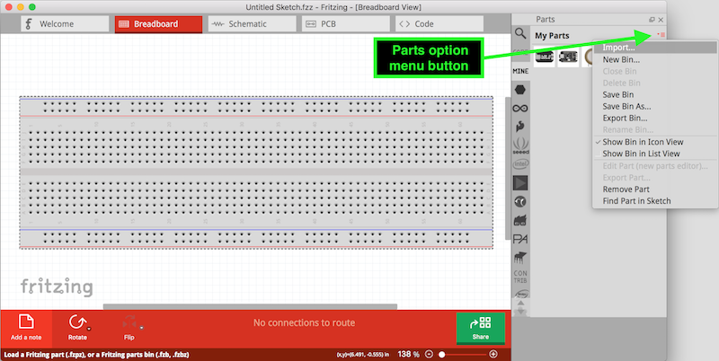

# Fritzing parts for Bela

[Fritzing](http://fritzing.org) is software for creating circuit diagrams, as well as designing simple, single-sided circuit boards.

This repository contains Fritzing parts for Bela and Bela Mini, as well as Trill sensors. To use them:

1. Clone this repository on your computer, or download the part you want to use
2. Install and open [Fritzing](http://fritzing.org)
3. Create a new project
4. In the Breadboard view, go to the Parts editor on the right. Select the option icon. From the dropdown menu, choose `Import ...` See below:

5. Navigate to the Bela Fritzing part you want to import on your comptuer, and click `Open`

Now your part will appear in your `My Parts` folder. You can see these parts in Fritzing by clicking the `MINE` in the parts explorer). Just drag it on to the breadboard view to start using it!
